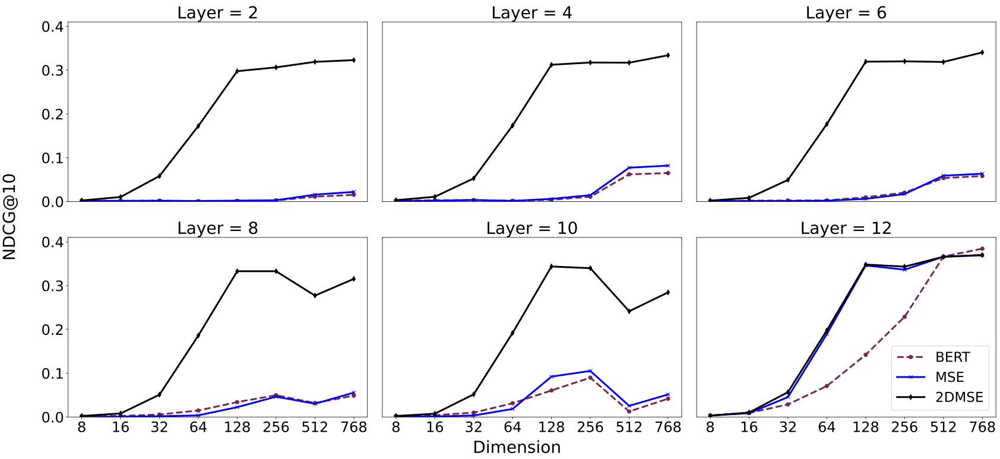
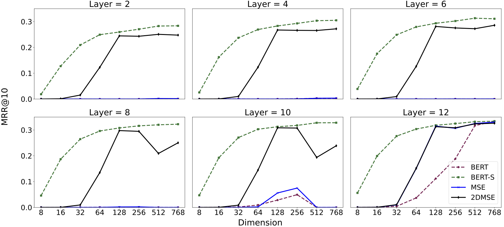
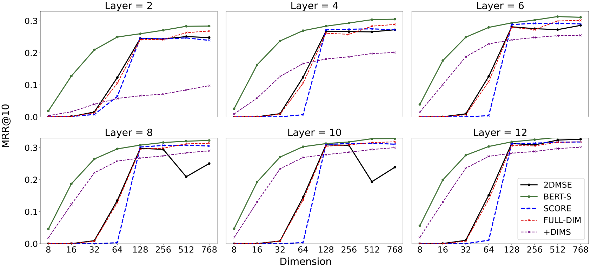
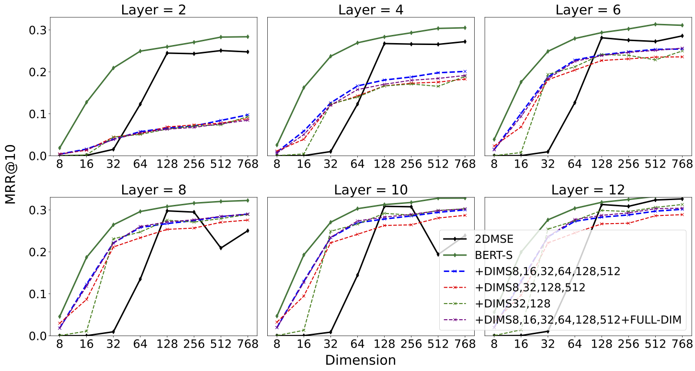
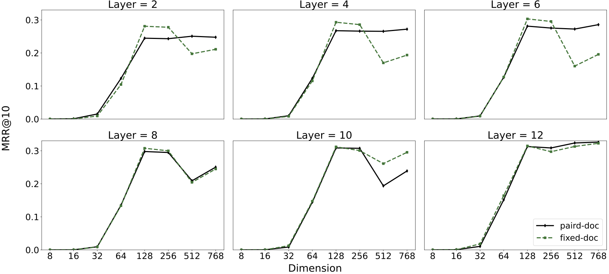

# 2DMSE-Reproduce
Reproduction code of 2DMSE

## Code for Reproduction

For the reproduction [STS_v1](code/STS_v1/README.md), please refer to `code/STS_v1/README.md`.

For the reproduction [STS_v2](code/STS_V2_Angle/README.md), please refer to `code/STS_V2_Angle/README.md`.

For the reproduction [Retrieval Task](code/Retrieval/README.md), please refer to `code/Retrieval/README.md`.

-----

## For STS (Semantic Textual Similarity) Reproduction

### Training Hyperparameters for STS Reproduction

- #### For V1

| Hyperparameter                  | Value                        |
|---------------------------------|------------------------------|
| Model Name                      | `bert-base-uncased`          |
| Batch Size                      | 128                          |
| Gradient Accumulation Steps     | 128                          |
| Number of Training Epochs       | 10                           |
| Learning Rate Warmup Steps      | 50                           |
| Sequence Length Limit           | No Limit Set (default)       |
| Optimizer                       | `AdamW` (default in Trainer) |
| Mixed Precision Training (FP16) | Enabled (`True`)             |
| BF16 Training                   | Disabled (`False`)           |
| Gradient Checkpointing          | Enabled (`True`)             |
| Save Strategy                   | `steps`                      |
| Save Total Limit                | 2 checkpoints                |
| Random Seed                     | 42                           |
| Loss Function                   | `Matryoshka2dLoss`           |

Notes:

- The model uses **MultipleNegativesRankingLoss** wrapped inside **Matryoshka2dLoss**, with dimensions [768, 512, 256, 128, 64, 32, 16, 8], to train the model across different representation sizes.
- `SentenceTransformerTrainer` is utilized for the training process, which allows for easy model training and evaluation integration.

-----

- #### For V2:

| Hyperparameter                  | Value                        |
|---------------------------------|------------------------------|
| Model Name                      | `bert-base-uncased`          |
| Batch Size                      | 128                          |
| Gradient Accumulation Steps     | 128                          |
| Number of Training Epochs       | 10                           |
| Learning Rate Warmup Steps      | 50                           |
| Sequence Length Limit           | No Limit Set (default)       |
| Optimizer                       | `AdamW` (default in Trainer) |
| Mixed Precision Training (FP16) | Enabled (`True`)             |
| BF16 Training                   | Disabled (`False`)           |
| Gradient Checkpointing          | Enabled (`True`)             |
| Output Directory                | `${model_name}/2d`           |
| Save Strategy                   | `steps`                      |
| Random Seed                     | 42                           |
| Loss Function                   | `Matryoshka2dLoss`           |
| Pooling Strategy                | `cls`                        |
| Maximum Sequence Length         | 128                          |
| Tokenizer Name                  | `bert-base-uncased`          |
| Learning Rate                   | 5e-5                         |
| Logging Steps                   | 100                          |
| Save Steps                      | 200                          |
| Warmup Steps                    | 50                           |
| Workers                         | 128                          |
| Epochs                          | 10                           |
| IBN Weight                      | 30.0                         |
| Cosine Weight                   | 0.0                          |
| Apply ESE                       | Enabled (`1`)                |
| ESE KL Temperature              | 1.0                          |
| ESE Compression Size            | 128                          |
| Angle Weight                    | 1.0                          |
| Angle Tau                       | 20.0                         |

-----
### Full Result for STS Reproduction

| Layer | Method  | V1 (8) | V1 (16) | V1 (32) | V1 (64) | V1 (128) | V1 (256) | V1 (512) | V1 (768) | V2 (8) | V2 (16) | V2 (32) | V2 (64) | V2 (128) | V2 (256) | V2 (512) | V2 (768) |
|-------|---------|--------|---------|---------|---------|----------|----------|----------|----------|--------|---------|---------|---------|----------|----------|----------|----------|
| 2     | BERT    | 0.444  | 0.522   | 0.578   | 0.607   | 0.624    | 0.634    | 0.574    | 0.589    | 0.253  | 0.297   | 0.313   | 0.335   | 0.339    | 0.335    | 0.335    | 0.337    |
|       | BERT-S  | 0.547  | **0.630**| **0.676**| **0.699**| **0.715**| **0.724**| **0.728**| **0.730**| **0.576**| **0.633**| **0.669**| **0.688**| **0.695**| **0.700**| **0.708**| **0.708**|
|       | MSE     | 0.441  | 0.520   | 0.575   | 0.608   | 0.627    | 0.635    | 0.576    | 0.590    | 0.264  | 0.322   | 0.332   | 0.351   | 0.357    | 0.354    | 0.351    | 0.352    |
|       | 2DMSE   | **0.559**| 0.621   | 0.656   | 0.674   | 0.681    | 0.684    | 0.675    | 0.680    | 0.504  | 0.603   | 0.644   | 0.669   | 0.675    | 0.684    | 0.684    | 0.685    |
| 4     | BERT    | 0.428  | 0.488   | 0.536   | 0.562   | 0.582    | 0.591    | 0.552    | 0.563    | 0.464  | 0.535   | 0.573   | 0.584   | 0.593    | 0.595    | 0.589    | 0.594    |
|       | BERT-S  | 0.570  | **0.642**| **0.699**| **0.723**| **0.738**| **0.744**| **0.749**| **0.751**| **0.620**| **0.671**| **0.702**| **0.722**| **0.730**| **0.735**| **0.738**| **0.737**|
|       | MSE     | 0.438  | 0.497   | 0.535   | 0.561   | 0.583    | 0.593    | 0.557    | 0.568    | 0.479  | 0.546   | 0.579   | 0.591   | 0.599    | 0.602    | 0.602    | 0.606    |
|       | 2DMSE   | **0.571**| 0.627   | 0.660   | 0.674   | 0.681    | 0.683    | 0.662    | 0.669    | 0.542  | 0.636   | 0.682   | 0.707   | 0.716    | 0.721    | 0.722    | 0.723    |
| 6     | BERT    | 0.463  | 0.502   | 0.529   | 0.555   | 0.565    | 0.563    | 0.566    | 0.572    | 0.433  | 0.483   | 0.518   | 0.536   | 0.543    | 0.545    | 0.543    | 0.547    |
|       | BERT-S  | 0.578  | **0.654**| **0.712**| **0.743**| **0.756**| **0.761**| **0.765**| **0.767**| **0.585**| **0.670**| **0.723**| **0.750**| **0.757**| **0.761**| **0.761**| **0.763**|
|       | MSE     | 0.464  | 0.513   | 0.533   | 0.557   | 0.572    | 0.569    | 0.577    | 0.583    | 0.428  | 0.483   | 0.514   | 0.539   | 0.544    | 0.549    | 0.550    | 0.554    |
|       | 2DMSE   | **0.588**| 0.637   | 0.671   | 0.687   | 0.690    | 0.690    | 0.673    | 0.681    | 0.561  | 0.646   | 0.699   | 0.729   | 0.736    | 0.732    | 0.737    | 0.737    |
| 8     | BERT    | 0.475  | 0.522   | 0.549   | 0.581   | 0.592    | 0.591    | 0.593    | 0.600    | 0.364  | 0.406   | 0.424   | 0.455   | 0.460    | 0.457    | 0.464    | 0.466    |
|       | BERT-S  | **0.612**| **0.677**| **0.736**| **0.763**| **0.778**| **0.782**| **0.786**| **0.788**| **0.620**| **0.690**| **0.738**| **0.766**| **0.776**| **0.782**| **0.787**| **0.790**|
|       | MSE     | 0.486  | 0.542   | 0.556   | 0.590   | 0.608    | 0.610    | 0.622    | 0.626    | 0.417  | 0.452   | 0.470   | 0.505   | 0.512    | 0.508    | 0.515    | 0.516    |
|       | 2DMSE   | 0.600  | 0.647   | 0.683   | 0.703   | 0.709    | 0.710    | 0.698    | 0.702    | 0.587  | 0.658   | 0.709   | 0.743   | 0.753    | 0.751    | 0.756    | 0.757    |
| 10    | BERT    | 0.572  | 0.631   | 0.672   | 0.693   | 0.702    | 0.708    | 0.711    | 0.717    | 0.498  | 0.569   | 0.597   | 0.621   | 0.624    | 0.632    | 0.619    | 0.624    |
|       | BERT-S  | 0.619  | **0.692**| **0.748**| **0.772**| **0.785**| **0.793**| **0.796**| **0.798**| **0.636**| **0.701**| **0.750**| **0.777**| **0.788**| **0.797**| **0.800**| **0.804**|
|       | MSE     | 0.603  | 0.659   | 0.689   | 0.717   | 0.729    | 0.735    | 0.744    | 0.747    | 0.530  | 0.585   | 0.616   | 0.641   | 0.649    | 0.656    | 0.648    | 0.653    |
|       | 2DMSE   | **0.639**| 0.686   | 0.721   | 0.736   | 0.745    | 0.750    | 0.744    | 0.752    | 0.577  | 0.649   | 0.709   | 0.744   | 0.754    | 0.753    | 0.745    | 0.749    |
| 12    | BERT    | 0.644  | 0.718   | 0.762   | 0.786   | **0.802**| **0.810**| **0.813**| **0.816**| **0.646**| **0.720**| 0.763   | 0.791   | 0.804    | 0.811    | **0.813**| **0.816**|
|       | BERT-S  | 0.644  | 0.718   | 0.762   | 0.786   | **0.802**| **0.810**| **0.813**| **0.816**| **0.646**| **0.720**| 0.763   | 0.791   | 0.804    | 0.811    | **0.813**| **0.816**|
|       | MSE     | **0.694**| **0.753**| **0.778**| **0.790**| 0.798    | 0.802    | 0.808    | 0.809    | 0.613  | 0.704   | **0.764**| **0.796**| **0.810**| **0.813**| **0.813**| **0.816**|
|       | 2DMSE   | 0.680  | 0.735   | 0.765   | 0.779   | 0.787    | 0.791    | 0.794    | 0.795    | 0.614  | 0.701   | 0.761   | 0.795   | 0.808    | 0.812    | 0.811    | 0.815    |

*Note*: Results are reported in Pearson correlation coefficient using averaged STS datasets. The best performance in each layer setup is highlighted in **bold**.

-----

## For Retrieval Task:

### Training Hyperparameters

| Hyperparameter                  | Value                      |
|---------------------------------|----------------------------|
| Model Name                      | `bert-base-uncased`        |
| Dataset Name                    | `Tevatron/msmarco-passage` |
| Pooling Strategy                | `cls`                      |
| Gradient Checkpointing          | Enabled (`True`)           |
| Learning Rate                   | 1e-4                       |
| Per Device Train Batch Size     | 128                        |
| Train Group Size                | 8                          |
| Query Max Length                | 32                         |
| Passage Max Length              | 196                        |
| Number of Training Epochs       | 3                          |
| Target Embedding Dimension      | 128                        |
| Logging Steps                   | 10                         |
| Overwrite Output Directory      | Enabled (`True`)           |
| Nodes                           | 1                          |
| CPUs Per Task                   | 10                         |
| Memory Per CPU                  | 100G                       |
| Score Alignment                 | Passed as Argument         |
| Compare to Last Layer           | Passed as Argument         |
| Passage to Last Layer           | Passed as Argument         |
| Sub Layer Full Dimension        | Passed as Argument         |

-----

- ### For Averaged BEIR dataset Retrieval Task using NDCG@10

  

- ### For MSMARCO Passage Retrieval Task using MRR@10

  

- ### For investigation of the effectiveness of different loss functions

  

- ### For investigation of the effectiveness of different DIMS combinations

  

- ### For investigation of fixed document encoding vs. Paired document encoding (Original 2DMSE)

  

